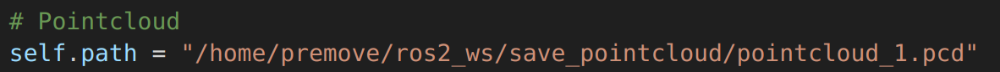

## Introduction
This work was made during 2 months and a half at the Escuela Tecnica Superior de Ingenieria Industriales under the supervision of Dr. Jesus Morales Rodriguez. The goal is to show the components we used, how they individualy work and how the calibration system works. We used:

- the Helios 5515 LiDAR from Robosense. \href{https://www.robosense.ai/en/rslidar/RS-Helios}{link}
- the ZED2i stereo camera from Stereolabs \href{https://www.stereolabs.com/zed-2i/}{link}
- the Compact Pro thermal Camera from SeekThermal \href{https://www.thermal.com/compact-series.html}{link}

## Multi-sensors calibration
### How to install

    To have a multi sensors calibration done, the package has 7 programs : 
      - save\_image.py and save\_pointcloud.py : Save images and point clouds,
      - open\_modify\_image.py and open\_modify\_pointcloud.py :Find the 2D key points in the images and the 3D key points in the point cloud,
      - calibration.py Get the extrinsic parameters associated with this key points using RANSAC algorithm. Then visualize the results of your calibration.
      - calib.py : library to store all the utility functions the other programs use.
    

    The package is really modular, you can modify one of the script use in a step without corrupting all your program. Moreover, if you want to make modifications, you can work on different part of the package with your colleagues at the same time.

### Steps to calibrate your system

    What you should have done before starting this part:
    
- Set up your mecanical system with all your sensors. You can find an example in the part 3 "Solidworks model" of this report. The sensors should not moving during all the calibration and in your future experiments. If they have move, you should restart the entire calibration,
- Install the ROS2 packages for your camera and your LiDAR. You can find the example of the components we have used in part 1 : "Installation" and how to interface to them with ROS2 in part 2 "How to use the components",       
- Install properly the ROS2 package named "calibration\_pkg" as described in the precedent subsection.
    


    The calibration is done in 3 steps. The steps are exactly the same for the image and the point cloud, you just have to use the correct program depending on if its an image or a point cloud.
    
#### Save your image and point cloud

        
- modify the path of the folders in the script where the images and the point clouds need to be saved on your computer
- modify the names of topics in the creation of subscribers

<p align="center">

</p>
<p align="center">

</p>

- build the package with your modification. Then, launch save\_image.py and save\_pointcloud.py
```
    cd ros2_ws
    source /opt/ros/<your-distro>/setup.bash
    colcon build --packages-select calibration_pkg
    source install/setup.bash
    ros2 launch calibration_pkg save_image.launch.py
        or
    ros2 launch calibration_pkg save_pointcloud.launch.py
```
- You can now open a visualization window by clicking on "V" key
- Put an object with the field of view of your camera and you LiDAR, for example a cardboard with a uniform color which contrast with the one of your background. This way it will be easier to differentiate corners of the cardboard from the background.
- During this step, take care of making room around your object. The more space around your object, the easier it will be for you to manage the point cloud in the next step.
- When you are satisfied with the pose of your object. Click on the "S" key of your keyboard to save the image or point cloud. You can find it in the folder you mentioned in your path. You have to try different poses, close and far from your sensors, with your object translated and rotated in different parts of your field of view. To have a good calibration, it is recommended to save at least 3 different images/point cloud. The more you have, the better your calibration will be. 
- Tip1: if you don't have a tripod to stabilize your cardboard, open both save\_image.py and save\_pointcloud.py at the same time. When you will press "S" both image and pointcloud will be saved at the same time
- Tip2: each time you save an image, the name of the image saved will change according to their number. Example "image\_1.png" -> "image\_2.png". And until you stop your program, the last image will be upgraded. be sure to stop the program before moving your cardboard

    
    
#### Find your 2D key points of the images and the 3D key points of your point cloud
        
- modify the path of the folders in the script where the images and the point clouds where saved in the former step

<p align="center">

</p>


<p align="center">

</p>

- build the package with your modification. Then, launch open\_modify\_image.py and open\_modify\_pointcloud.py
```
    cd ros2_ws
    source /opt/ros/<your-distro>/setup.bash
    colcon build --packages-select calibration_pkg
    source install/setup.bash
    ros2 launch calibration_pkg open\_modify\_image.launch.py
        or
    ros2 launch calibration_pkg open\_modify\_pointcloud.launch.py
```

- You can now open a visualization window by clicking on "V" key. You can see a window opening with the point cloud or image you saved.
- Click on "M" key to modify the points studied. Your goal is to minimize the zone of research and then click on "P" key to print the points. If you reduce your searching zone too quickly and have no points left to study the script may crash. So, be cautious when you are working with small zones.

<p align="center">

</p>

<p align="center">

</p>


- If it is hard for you to focus on few points with the current resolution, open another shell and write : 
```
    cd ros2_ws
    source /opt/ros/<your-distro>/setup.bash
    ros2 param set /open_modify_image_node shift 1
        or
    ros2 param set /open_modify_image_node shift 0.1
```

- The value of your image parameter needs to be a positive integer and the value of your point cloud parameter needs to be a float, it can be negative or positive.
- Note down the coordinates you got and be care to study the same point in your image and your point cloud. They will be linked between themselves in the next step.


#### Get extrinsic parameters and visualize your resulting calibration
        
- Modify the intrinsic parameters of your camera in your script. If you use the ZED2i camera, the zed\_wrapper package we detailed in part 2 "How to use components" allow you to find them by launching the program and echoing camera\_info
    
    First shell:
```
    cd ros2_ws
    source /opt/ros/<your-distro>/setup.bash
    ros2 launch zed_wrapper zed2i.launch.py
```
    Second shell:
    
```
    cd ros2_ws
    source /opt/ros/<your-distro>/setup.bash
    ros2 topic echo /zed2i/zed_node/rgb/camera_info
```
<p align="center">

</p>


- As we subscribe to the rectified image of ZED2i camera, the distortion coefficients of your camera are 0,0,0,0,0. If you use another components or you subscribe to another topic, change them.
- Add the coordinates of your 3D points in the list objectPoints and the coordinates of your 2D points in the list imagePoints. The coordinates k of your list objectPoints must represent the same point as the coordinates k of your list imagePoints. If you took points from different images, you can add them to the list without any problem as long as you components are in same positions.
- When you are ready launch your node visualize the results of your program.
```
    cd ros2_ws
    source /opt/ros/<your-distro>/setup.bash
    colcon build --packages-select calibration_pkg
    source install/setup.bash
    ros2 launch calibration_pkg calibration.launch.py
```
    
- You have finished your calibration. If the results are not perfect, add other points in different positions and place of your field of view. Don't forget to rotate your object, put it in the corners of your Field of view, at the top or at the bottom of your image.

<p align="center">

</p>
<p align="center">

</p>


## Use the components we used:    
### OS2 \& Ubuntu

To use this work, you need to use ROS2 as every package was made with ROS2 galactic under Ubuntu 20.04. You can also use ROS2 Humble with Ubuntu 22.04. To install ROS2 Galactic, you can follow the steps of the official ROS website: https://docs.ros.org/en/galactic/Installation/Ubuntu-Install-Debians.html
    
### LiDAR

<p align="center">

</p>

        We used the Robosense helios 5515 as a LiDAR. You can copare it to the other Robosense LiDAR on the official page : https://www.robosense.ai/en/rslidar/RS-Helios. And buy it on Robosense webpage : https://www.roscomponents.com/en/lidar-laser-scanner/312-rs-helios-5515-.html. The package we will download is named rslidar_sdk. First, download the package from the official GitHub of the package : \href{https://github.com/RoboSense-LiDAR/rslidar_sdk}{link}. This package needs extra steps to work properly : 
        
- Follow the steps to install the package in <workspace>/src folder as written on the package GitHub : https://github.com/RoboSense-LiDAR/rslidar_sdk. You will also need to install Yaml and libpcap.
- If you use ROS2, you have to modify the file package.xml and replace its content by the contents package\textunderscore ros2.xml
- To indicate to the package what LiDAR you use, modify the file config/config.yaml by changing the lidar\textunderscore type of your LiDAR. (In my case lidar\textunderscore type: RSHELIOS)


### Stereo Camera
<p align="center">

</p>


The stereo camera we used is the ZED2i stereo cameras. https://www.stereolabs.com/zed-2i/. 
        
To use our stereo camera we will need the zed_wrapper package https://github.com/stereolabs/zed-ros2-wrapper. To install it, it's pretty straight forward, you will need to install two dependencies and the package: 

- CUDA: https://developer.nvidia.com/cuda-downloads?target_os=Linux&target_arch=x86_64&Distribution=Ubuntu&target_version=20.04&target_type=deb_local
- and ZED SDK: \href{https://www.stereolabs.com/developers/release/}{link}
- and follow the steps of the GitHub.

  After that, you only have to plug your ZED2i camera on a 3.2 USB port. Your camera is set up.
    

### Thermal Camera

We used the Seek thermal compact pro camera: https://www.thermal.com/compact-series.html. No package was created for ROS2 so we had to create on by ourself, you can find the package on my other repository named : seek_thermal_ROS2.This package is the most difficult to install properly. 

<p align="center">

</p>


### How to correct installation issues :
**I can't build OpenCV3**
If you installed the stereo camera package, you installed CUDA. This software layer can cause you some troubles with OpenCV3 installation. To prevent it, you will need to add \textbf{-DWITH\_CUDA = OFF} when you are building your package. OpenCV3 will now be installed without using CUDA but it's not mandatory and your package will work without it.

**libjasper-dev is not found on my computer**
When you will install OpenCV3 you may have problems with the library libjasper-dev. If it's the case, use this link to find solutions to your problem \href{https://askubuntu.com/questions/1145811/error-installing-libjasper-dev-and-libpng12-package-in-ubuntu-19-04?rq=1}{link}

**Even with this change I can't build it**
Another problem we had when building OpenCV3 was the make command line which crashed during the process because we used too many threads. The computer we used had 24 threads, we had to only use 4 threads to make it compile properly: **make -j4**

**I have a Cmakelist.txt problem**
You may also have a problem when compiling your seekthermal\_camera package because of your Cmakelist.txt. To prevent it, navigate to your package > vendor > libseekthermal\_lite > Cmakelist.txt. Open this file and replace the line find\_package{OpenCV 3 REQUIRED COMPONENTS} by \textbf{find\_package{OpenCV 3 REQUIRED}}. 

<p align="center">

</p>  


        
